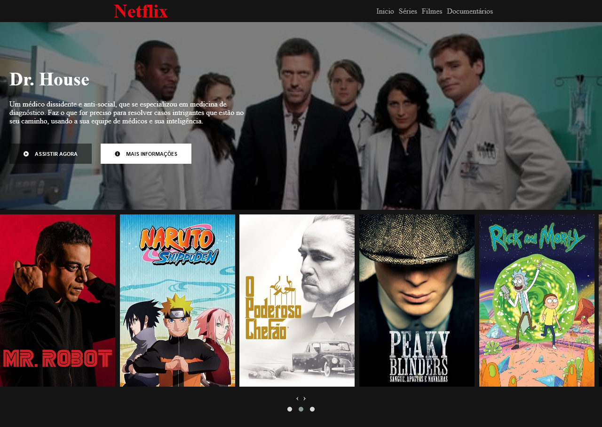

## Recriando a interface da Netflix

>  Site desenvolvido para estudos e práticas de HTML, CSS, JS e JQuery

   

### Tecnologias utilizadas:

* HTML
* CSS
* JS
* [JQuery](https://jquery.com/)
* [FontAwesome](https://fontawesome.com/)

[Acesse o site clicando aqui](https://theslladev.github.io/Netflix-Clone/)